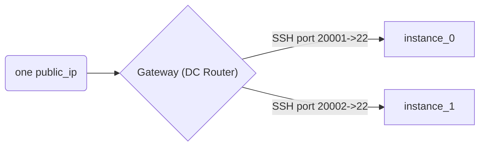

## IaC labs for Workshop



### Run fleet of labs:

```bash
terraform init

# copy VARS.example and fill it
. VARS

terraform apply
```

### Parameters

See in `variables.tf`

### Get data for workshop

```
# port:password table of labs
terraform output -json | jq .instance_listing.value

# public ip
terraform output -raw public_ip

```
