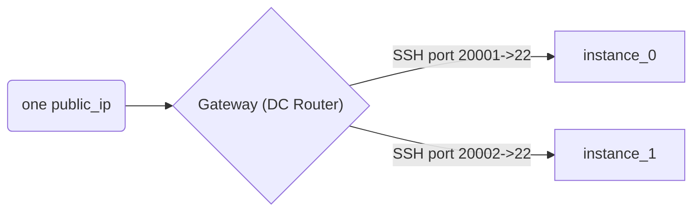

## IaC labs for Workshop



### Run fleet of labs:

```bash
terraform init

# copy VARS.example and fill it
. VARS

terraform apply
```

### Parameters

See in `variables.tf`

### Get data for workshop

```
# port:password table of labs
terraform output -json | jq .instance_listing.value

# public ip
terraform output -raw public_ip

# collect all bash histories
ssh-add ~/.ssh/VM_KEYS
GW_IP=$(terraform output -raw public_ip)
for i in $(terraform output -json | jq .instance_listing.value  | jq "keys[]" -r); do scp -P $i -o StrictHostKeyChecking=no -o UserKnownHostsFile=/dev/null debian@$GW_IP:/home/debian/.bash_history ./histories/$i & done
sleep 5
for i in $(terraform output -json | jq .instance_listing.value  | jq "keys[]" -r); do ssh -p $i -o StrictHostKeyChecking=no -o UserKnownHostsFile=/dev/null debian@$GW_IP -f 'sudo cp /root/.bash_history /tmp/root_history' & done
sleep 5
for i in $(terraform output -json | jq .instance_listing.value  | jq "keys[]" -r); do ssh -p $i -o StrictHostKeyChecking=no -o UserKnownHostsFile=/dev/null debian@$GW_IP -f 'sudo chmod 777 /tmp/root_history' & done
sleep 5
for i in $(terraform output -json | jq .instance_listing.value  | jq "keys[]" -r); do scp -P $i -o StrictHostKeyChecking=no -o UserKnownHostsFile=/dev/null debian@$GW_IP:/tmp/root_history ./histories/root_$i & done

```
